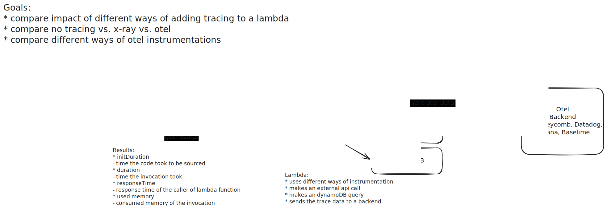

# AWS Lambda otel performance test




## Current Results

**CloudWatch Logs Insights**  
region: eu-west-3  
log-group-names: /aws/lambda/otel-adot-lambda, /aws/lambda/otel-base, /aws/lambda/xray-base, /aws/lambda/datadog-base  
start-time: -3600s  
end-time: 0s  
query-string:

```
fields @timestamp, @message, @logStream, @log, record.metrics.memorySizeMB as memorySizeMB, record.metrics.initDurationMs as initDurationMs, record.metrics.durationMs as durationMs
| filter type== "platform.report"
| parse @log "906407660701:/aws/lambda/*" as functionName

| stats avg(initDurationMs) as avgInitDurationMs, min(initDurationMs) as minInitDurationMs, max(initDurationMs) as maxInitDurationMs, pct(initDurationMs, 50) as p50InitDurationMs, pct(initDurationMs, 90) as p90InitDurationMs, pct(initDurationMs, 99) as p99InitDurationMs by memorySizeMB,functionName
| sort functionName
| limit 1000
```

---

| memorySizeMB | functionName     | avgInitDurationMs | minInitDurationMs | maxInitDurationMs | p50InitDurationMs | p90InitDurationMs | p99InitDurationMs |
| ------------ | ---------------- | ----------------- | ----------------- | ----------------- | ----------------- | ----------------- | ----------------- |
| 1024         | datadog-base     | 1196.095          | 1196.095          | 1196.095          | 1196.095          | 1196.095          | 1196.095          |
| 128          | datadog-base     | 1149.0365         | 1144.786          | 1153.287          | 1144.786          | 1153.287          | 1153.287          |
| 128          | otel-adot-lambda | 1240.4965         | 1229.106          | 1254.003          | 1239.175          | 1254.003          | 1254.003          |
| 1024         | otel-adot-lambda | 1269.3763         | 1254.028          | 1294.631          | 1263              | 1294.631          | 1294.631          |
| 128          | otel-base        | 291.7128          | 285.545           | 295.461           | 292.711           | 295.461           | 295.461           |
| 1024         | otel-base        | 286.944           | 279.239           | 293.448           | 285.383           | 293.448           | 293.448           |
| 128          | xray-base        | 358.9678          | 346.297           | 373.125           | 358.028           | 373.125           | 373.125           |
| 1024         | xray-base        | 357.1368          | 351.453           | 366.086           | 353.459           | 366.086           | 366.086           |

---
